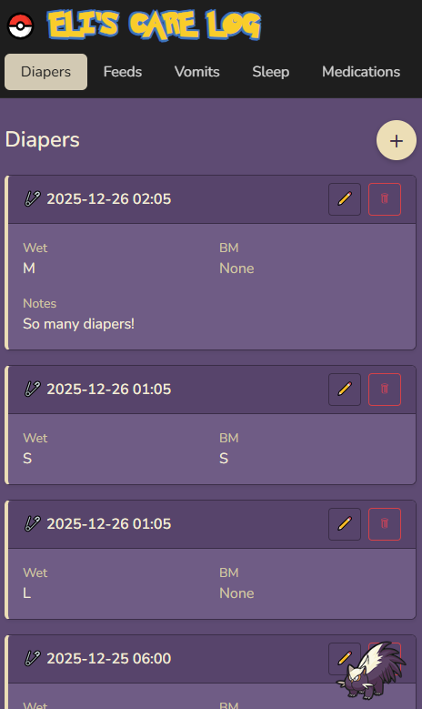

# Eli's Care Log

Eli's Care Log is a self-hosted Flask web application for tracking infant care events such as diapers, feeds, sleep, medications, and vomiting incidents.

It was built to be fast to use, visually clear on mobile and desktop, and reliable for long-term daily tracking without relying on third-party apps or cloud services.

---

## Why This App Exists

Before building Eli's Care Log, all care tracking was done manually using printed spreadsheets kept in a binder. Sheets were filled out by hand, replaced frequently as they ran out, and often torn or lost due to heavy daily use by multiple caregivers.

This approach worked, but it was slow, fragile, and hard to maintain consistently.

Eli's Care Log was created to replace that system with something faster, more durable, and easier to use across devices. Nurses use the app on a shared tablet during care, while my wife and I can log and review entries from our phones in real time.

The goal was not to build a complex analytics platform, but a simple, reliable tool that mirrors real-world workflows while removing friction. Entries are quick to create, statuses are visually clear, and the interface stays readable even during busy or low-light situations.

---

## Features

- Dashboard with quick stats and recent activity
- Diaper tracking (wet, BM, size, notes)
- Feed tracking with:
    - Start/end times
    - Volume and feed rate
    - Automatic status detection (in progress, incomplete, complete)
- Sleep tracking with automatic duration calculation
- Medication logging with dosage and initials
- Vomit tracking with size, feed rate, and notes
- Pagination for all logs
- Visual status badges for incomplete or active entries
- Pokémon-inspired color themes per log type
- Mobile-friendly UI
- SQLite persistence with safe backups

---

## Screenshots
*Screenshots use sample data only.*

### Dashboard
<p align="center">
    
</p>

### Diaper Log
<p align="center">
    
</p>

<p align="center">
    <em>Primary diaper log view.</em>
</p>

<p align="center">
    
</p>

<p align="center">
    <em>Pagination via “See more” button for long-term, high-volume logs.</em>
</p>

### Feed Log
<p align="center">
    
</p>

<p align="center">
    <em>Feed entries showing status badges for in-progress and incomplete feeds. Toast notification confirming a successful feed update.</em>
</p>

### Sleep Log
<p align="center">
    
</p>

### Medication Log
<p align="center">
    
</p>

<p align="center">
    <em>Medication history with confirmation toast after deletion.</em>
</p>

---

## Tech Stack

- Python 3
- Flask
- Flask-SQLAlchemy
- SQLite
- Jinja2
- Bootstrap 5
- Docker (optional, used in production)

---

## Project Structure

```text
eli-care-log/
├── app.py
├── models.py
├── ui_themes.py
├── requirements.txt
├── Dockerfile
├── README.md
├── scripts/
│   ├── backup_db.sh
│   └── deploy.sh
├── routes/
│   ├── diaper_routes.py
│   ├── feed_routes.py
│   ├── sleep_routes.py
│   ├── medication_routes.py
│   └── vomit_routes.py
├── templates/
│   ├── base.html
│   ├── dashboard.html
|   ├── diaper_*.html
|   ├── feed_*.html
|   ├── sleep_*.html
|   ├── medication_*.html
|   ├── vomit_*.html
│   └── partials/
│       ├── _navbar.html
│       ├── _theme_css.html
│       └── _toast.html
├── static/
│   ├── icons/
│   ├── fonts/
│   └── manifest.json
├── screenshots/
│   ├── dashboard.png
│   ├── diaper.png
│   ├── feed.png
│   ├── sleep.png
│   └── medication.png
└── db/
    └── eli_care_log.db