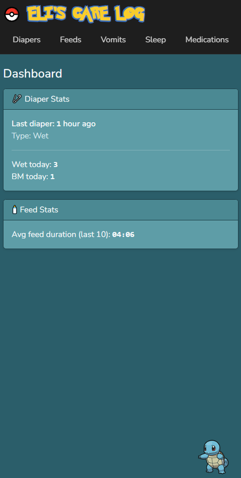
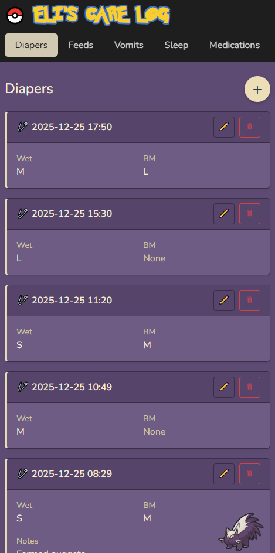
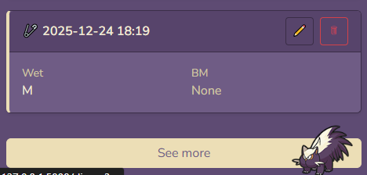
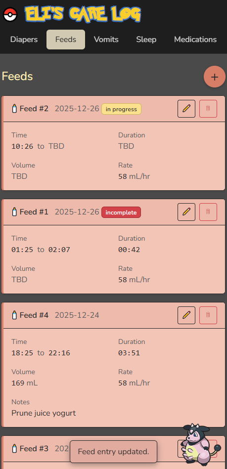
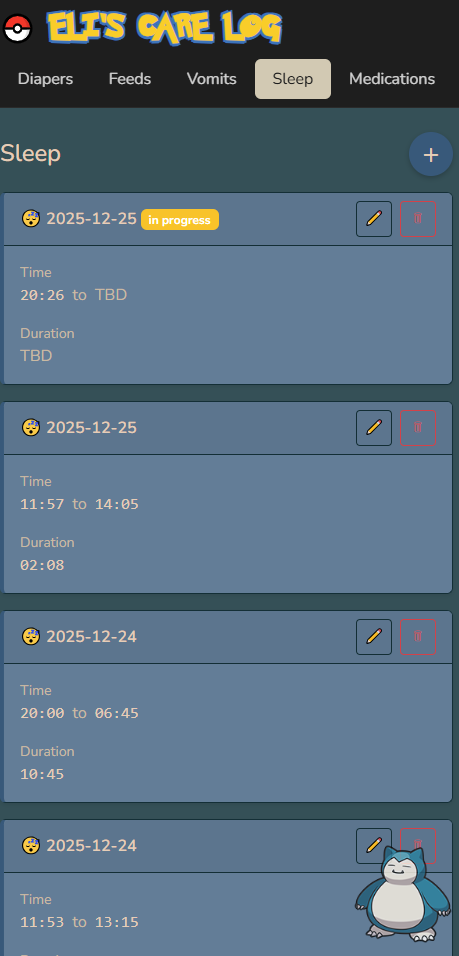
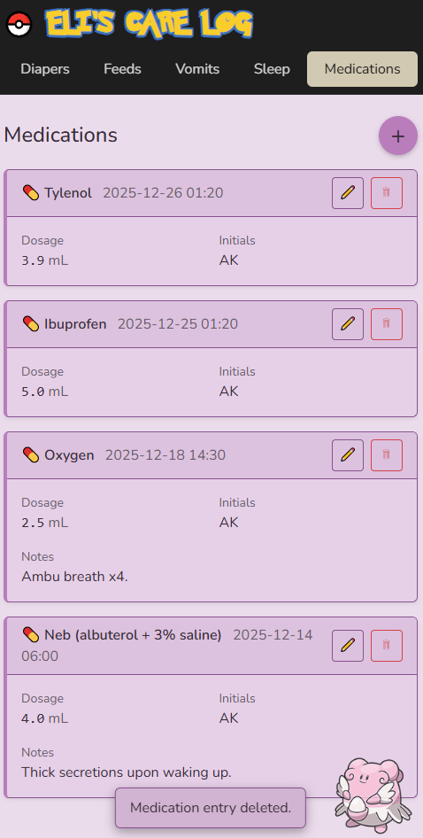

# Eli's Care Log

Eli's Care Log is a self-hosted Flask web application for tracking infant care events such as diapers, feeds, sleep, medications, and vomiting incidents.

It was built to be fast to use, visually clear on mobile and desktop, and reliable for long-term daily tracking without relying on third-party apps or cloud services.

---

## Features

- Dashboard with quick stats and recent activity
- Diaper tracking (wet, BM, size, notes)
- Feed tracking with:
  - Start/end times
  - Volume and feed rate
  - Automatic status detection (in progress, incomplete, complete)
- Sleep tracking with automatic duration calculation
- Medication logging with dosage and initials
- Vomit tracking with size, feed rate, and notes
- Pagination for all logs
- Visual status badges for incomplete or active entries
- Pokémon-inspired color themes per log type
- Mobile-friendly UI
- SQLite persistence with safe backups

---

## Screenshots

> Screenshots are stored in the `screenshots/` folder and referenced below.

### Dashboard


### Diaper Log




### Feed Log


### Sleep Log


### Medication Log


---

## Tech Stack

- Python 3
- Flask
- Flask-SQLAlchemy
- SQLite
- Jinja2
- Bootstrap 5
- Docker (optional, used in production)

---

## Project Structure

```text
eli-care-log/
├── app.py
├── models.py
├── ui_themes.py
├── requirements.txt
├── Dockerfile
├── README.md
├── scripts/
│   ├── backup_db.sh
│   └── deploy.sh
├── routes/
│   ├── diaper_routes.py
│   ├── feed_routes.py
│   ├── sleep_routes.py
│   ├── medication_routes.py
│   └── vomit_routes.py
├── templates/
│   ├── base.html
│   ├── dashboard.html
|   ├── diaper_*.html
|   ├── feed_*.html
|   ├── sleep_*.html
|   ├── medication_*.html
|   ├── vomit_*.html
│   └── partials/
│       ├── _navbar.html
│       ├── _theme_css.html
│       └── _toast.html
├── static/
│   ├── icons/
│   ├── fonts/
│   └── manifest.json
├── screenshots/
│   ├── dashboard.png
│   ├── diaper.png
│   ├── feed.png
│   ├── sleep.png
│   └── medication.png
└── db/
    └── eli_care_log.db